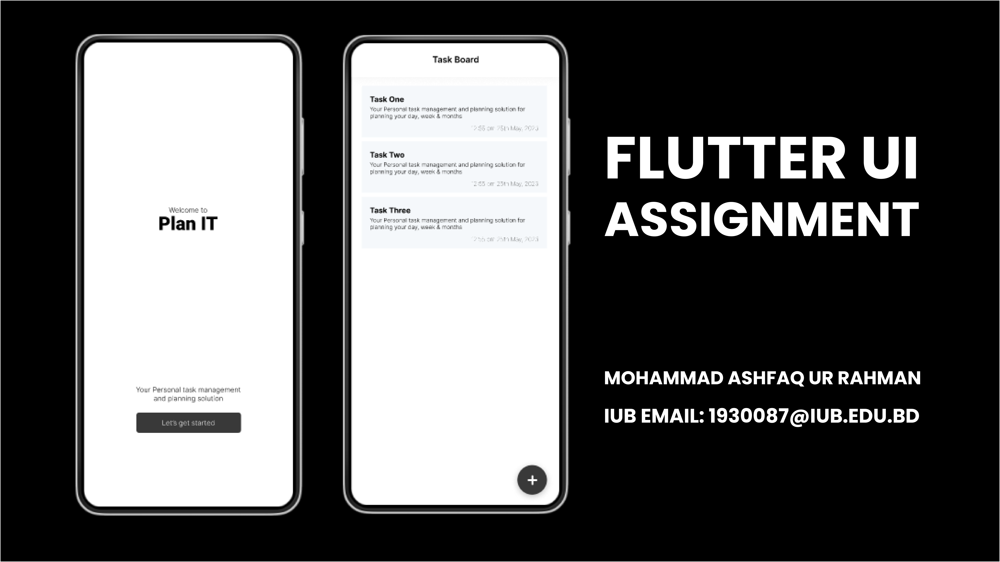

# Task Listing Flutter App



## Overview

The Task Listing Flutter App is a mobile application developed by Mohammad Ashfaq Ur Rahman. The app allows users to manage their daily tasks, helping them stay organized and focused on their goals. With a user-friendly interface and intuitive design, the app provides a seamless experience for creating, editing, and marking tasks as complete.

## Features

- Create new tasks with title and description.
- Set due dates and priorities for tasks.
- Mark tasks as completed.
- Edit and update task details.
- View all tasks in a list format.
- Filter tasks based on completion status and priority.
- User authentication for secure access (optional).

## Technologies Used

- Flutter: The app is developed using the Flutter framework, allowing for a cross-platform experience on both Android and iOS devices.
- Dart: The programming language used for developing the Flutter app.
- Firebase (optional): Firebase can be integrated for user authentication and data storage.

## Getting Started

To run the Task Listing Flutter App locally on your machine, follow these steps:

1. Install Flutter: If you haven't installed Flutter yet, follow the installation guide from the official Flutter website: [Flutter Installation Guide](https://flutter.dev/docs/get-started/install)

2. Clone the repository: Use `git clone` to clone the project repository to your local machine.

```
git clone https://github.com/ashfaqfardin/flutter_task_listing_application.git
```